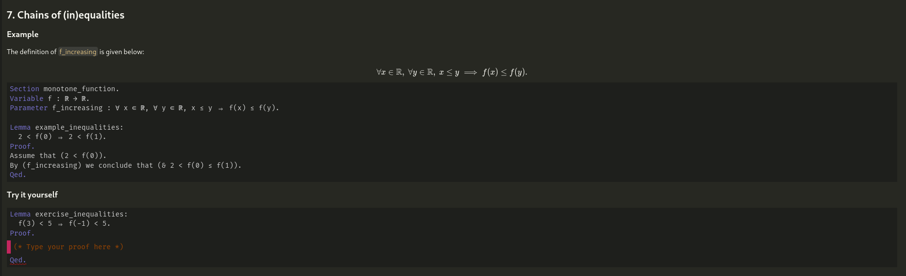

# Important
WaterproofEditor is currently developed as a part of the [waterproof-vscode](https://www.github.com/impermeable/waterproof-vscode) project, but will be moved into this repository eventually.

At the present this repostiory is very much a work in progress.

# WaterproofEditor

This repository contains the source required to construct the editor as is used in the [waterproof-vscode](https://www.github.com/impermeable/waterproof-vscode) extension.

## Mixed documents

WaterproofEditor supports and is designed to be used with mixed documents, containing code as well as rich text in the form of Markdown or LaTeX.

#### Example (adapted from [waterproof-vscode](https://www.github.com/impermeable/waterproof-vscode))

As WaterproofEditor was designed to be used in an educational setting it supports two additional types of 'cells':
- **Input areas**: Specific regions of a document meant to be edited.
- **Hints**: Collapseable regions of a document that can be used to hide parts of a document from a user. This can be used to give hints to students or to simply hide the import of packages/libraries.