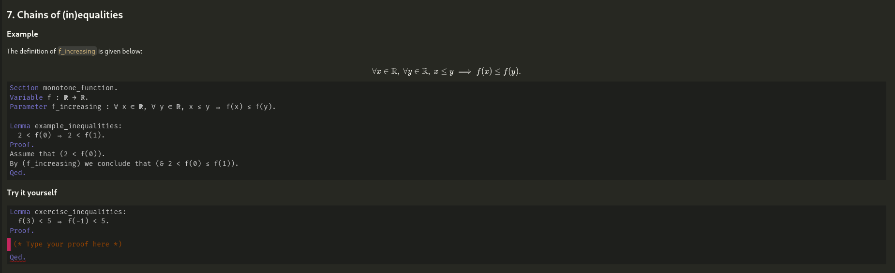

# WaterproofEditor

This repository contains the source required to construct the editor as is used in the [waterproof-vscode](https://www.github.com/impermeable/waterproof-vscode) extension.

## Mixed documents

WaterproofEditor supports and is designed to be used with mixed documents, containing code as well as rich text in the form of Markdown or LaTeX.

#### Example (adapted from [waterproof-vscode](https://www.github.com/impermeable/waterproof-vscode))


As WaterproofEditor was designed to be used in an educational setting it supports two additional types of 'cells':
- **Input areas**: Specific regions of a document meant to be edited.
- **Hints**: Collapsible regions of a document that can be used to hide parts of a document from a user. This can be used to give hints to students or to simply hide the import of packages/libraries.

## Development

### Installing dependencies
Run `npm install` or `npm i` in the root folder of the repository.

### Formatting
Run `npm run format` to auto-format all TypeScript/JavaScript files. Run `npm run format:check` to check without writing.

### Git hooks
This repository includes a pre-commit hook that blocks commits with formatting issues. To enable it, run once after cloning:
```
git config core.hooksPath hooks
```
If the hook rejects your commit, run `npm run format` and stage the changes before retrying.
